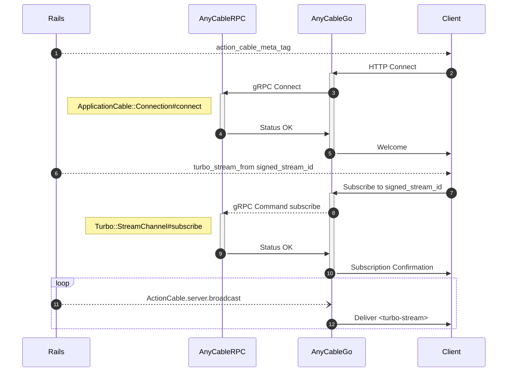
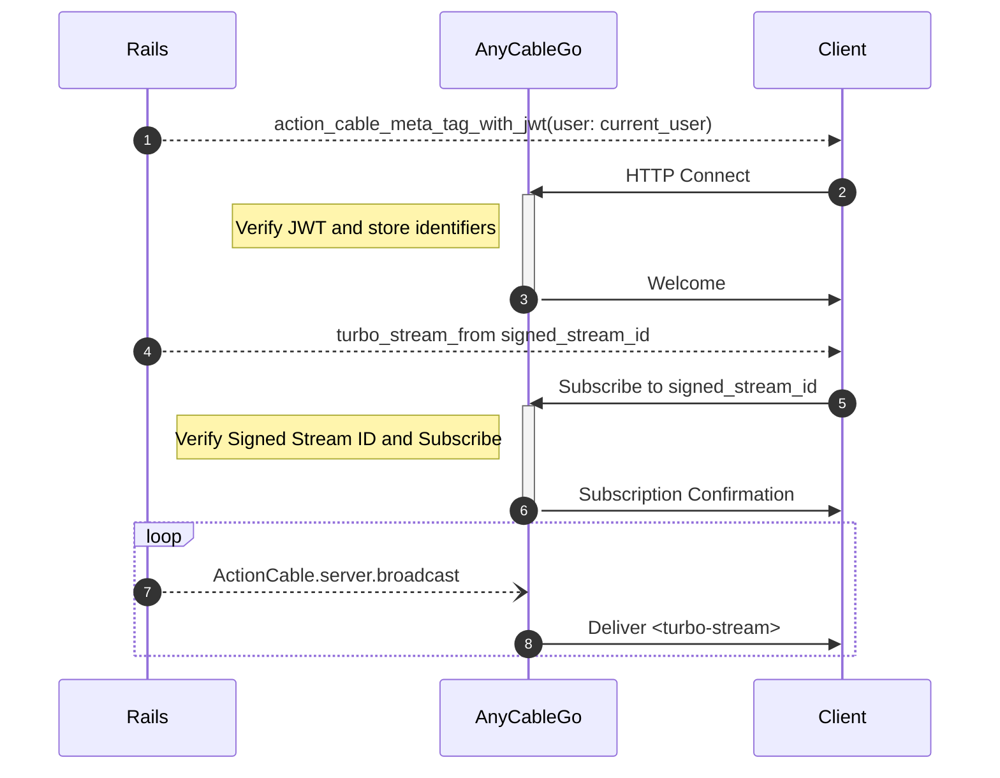

# Using AnyCable with Hotwire

AnyCable is fully compatible with [Hotwire][] applications without the need for any additional configuration. See the [getting started guide](./getting_started.md) here.

However, you can squeeze even more _power_ from AnyCable for Hotwire apps by combining several features. Read below.

## RPC-less setup

> 📖 See also [JWT identification and “hot streams”](https://anycable.io/blog/jwt-identification-and-hot-streams/).

AnyCable-Go provides a feature called [signed streams](../anycable-go/signed_streams.md), which implements the require `turbo-rails` Action Cable functionality right in the WebSocket server. This means that subscribing to Turbo Streams doesn't require calling a gRPC Rails server.

If you're only using Turbo Streams and don't rely on _pure_ Action Cable, you can simplify your AnyCable configuration (infrastructure, deployment) by switching to signed streams and [JWT authentication](../anycable-go/jwt_identification.md).

**What's the point?** Here are the main benefits of going the RPC-less way:

- Improve applications performance by speeding up WebSocket handshakes and commands.
- Reduce the infrastructure burden by not running a separate service (RPC). Especially helpful on [Heroku](../deployment/heroku.md).
- Open the possibility of using Turbo Streams without Rails and even Ruby!

The default flow with AnyCable RPC looks like this:



Compare this with the RPC-less configuration which has the aforementioned features:



> 🎥 Check out this AnyCasts screencast—it's a video guide on setting up Hotwire with AnyCable in the RPC-less way: [Exploring Rails 7, Hotwire and AnyCable speedy streams](https://anycable.io/blog/anycasts-rails-7-hotwire-and-anycable/).

### Step-by-step guide on going RPC-less

- Install and configure the [anycable-rails-jwt][] gem:

```yml
# anycable.yml
production:
  jwt_id_key: "some-secret-key"
```

- Configure the Turbo Streams verifier key:

```ruby
# config/environments/production.rb
config.turbo.signed_stream_verifier_key = "s3cЯeT"
```

- Disable `Disconnect` RPC calls and enable JWT identification and signed streams in AnyCable-Go:

```sh
ANYCABLE_JWT_ID_KEY=some-secret-key \
ANYCABLE_TURBO_RAILS_KEY=s3cЯeT \
ANYCABLE_DISABLE_DISCONNECT=true \
anycable-go

# or via cli args
anycable-go --jwt_id_key=some-secret-key --turbo_rails_key=s3cЯeT --disable_disconnect
```

**NOTE:** Disabling `Disconnect` calls is safe unless you have some custom logic in the `ApplicationCable::Connection#disconnect` method. Otherwise, you still need to run the RPC server.

[Hotwire]: https://hotwired.dev
[anycable-rails-jwt]: https://github.com/anycable/anycable-rails-jwt
