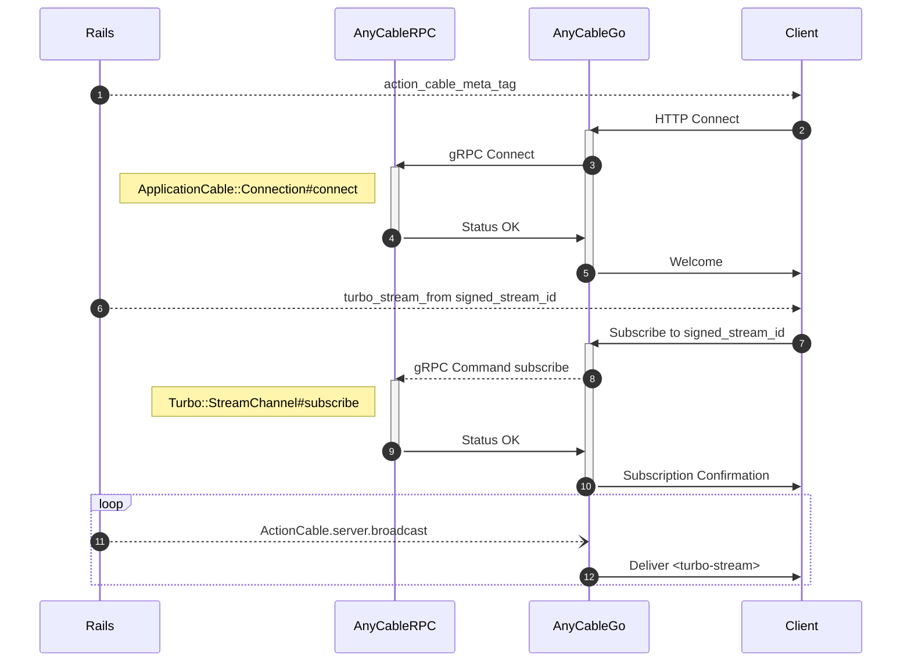
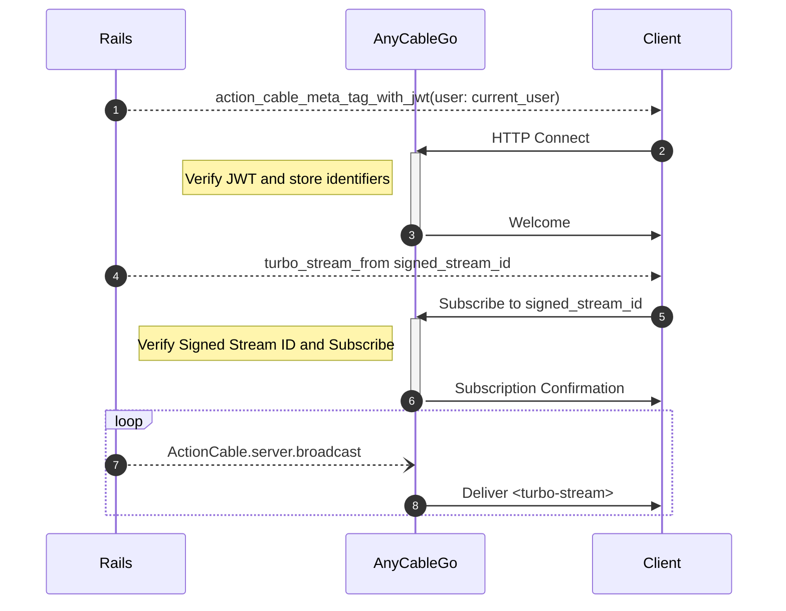

# Using with Hotwire

AnyCable is fully compatible with [Hotwire][] applications without any additional configuration. See [Getting started guide](./getting_started.md).

## RPC-less setup

> 📖 See also [JWT identification and “hot streams”](https://anycable.io/blog/jwt-identification-and-hot-streams/).

AnyCable-Go provides a feature called [signed streams](../anycable-go/signed_streams.md), which implements the require `turbo-rails` Action Cable functionality right in the WebSocket server. That means, subscribing to Turbo Streams doesn't require calling a gRPC Rails server.

In case you're using only Turbo Streams and not relying on _pure_ Action Cable, you can simplify your AnyCable configuration (infrastructure, deployment) by switching to signed streams and [JWT authentication](../anycable-go/jwt_identification.md).

The default flow with AnyCable RPC looks like this:



Compare it to the RPC-less configuration with the aforementioned features below:



> 🎥 Check out this AnyCasts screencast as a video guide on setting up Hotwire with AnyCable in the RPC-less way: [Exploring Rails 7, Hotwire and AnyCable speedy streams](https://anycable.io/blog/anycasts-rails-7-hotwire-and-anycable/).

### Step-by-step guide on going RPC-less

- Install and configure [anycable-rails-jwt][] gem:

```yml
# anycable.yml
production:
  jwt_id_key: "some-secret-key"
```

- Configure Turbo Streams verifier key:

```ruby
# config/environments/production.rb
config.turbo.signed_stream_verifier_key = "s3cЯeT"
```

- Disable Disconnect calls and enable JWT identification and signed streams in AnyCable-Go:

```sh
ANYCABLE_JWT_ID_KEY=some-secret-key \
ANYCABLE_TURBO_RAILS_KEY=s3cЯeT \
ANYCABLE_DISABLE_DISCONNECT=true \
anycable-go

# or via cli args
anycable-go --jwt_id_key=some-secret-key --turbo_rails_key=s3cЯeT --disable_disconnect
```

**NOTE:** Disabling `Disconnect` calls is safe unless you have some custom logic in the `ApplicationCable::Connection#disconnect` method. Otherwise, you still need to run the RPC server.

[Hotwire]: https://hotwired.dev
[anycable-rails-jwt]: https://github.com/anycable/anycable-rails-jwt
